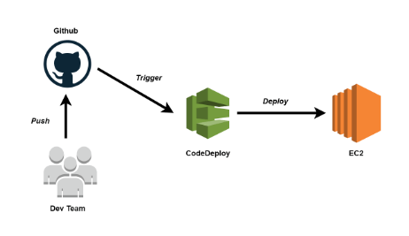

# EngineGroup
Nodejs Application with CI/CD using Github Actions.

# Steps followed:
1. Setup Nodejs server to accept requests coming from the client.
2. Puzzle.js to solve the puzzle.
3. Deployed application on EC2 instance.

1. Nodejs Server
    Built an express app and exposed GET endpoint on port 3000
    Responded with correct answers to all the questions.

2. Solving puzzle
    Decyphered rules/patterns present in the question and answer.
    Out of 4 blanks, 1 blank was provided in the question.
    Second was always = in every letter in ascending order
    For the other 2 blanks, these were the theories considered:

    a. The letter with equal sign always has the values in inverted format of the existing ones.

    b. There is always one >>> , <<< and either ><< or <>>

The idea was to create a matrix and solve each line using all these rules. 
I also observed that the answer kind off behaves like a transpose, where the values are inverse of one another in positions along the diagonal(ie. along the '=' sign line)

Using this logic along with the rules, I was able to successfully solve the puzzle.

To keep the app live, I deployed it on AWS EC2 instance and setup a CI/CD pipeline using Github Actions and AWS CodeDeploy.

    